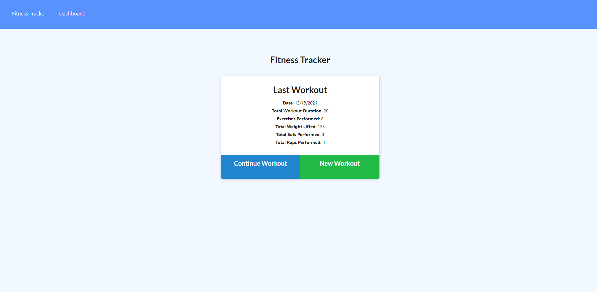
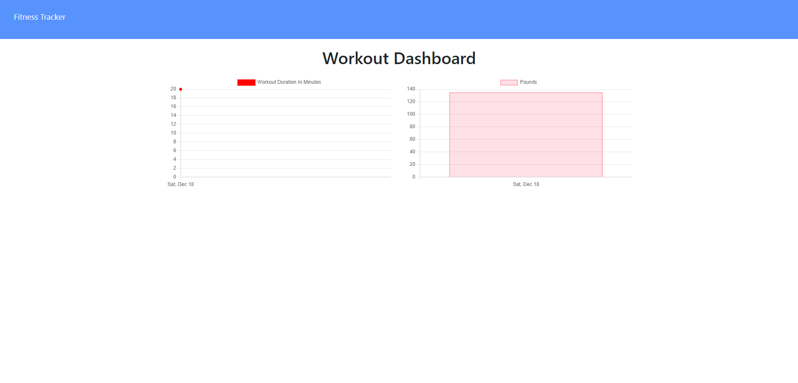

# workoutTracker

## Table of Contents
- [Overview](#overview)
- [Technology Used](#technology-used)
- [Installation and Start](#installation-and-start)
- [Link to Deployed Site](#link-to-deployed-site)
- [Screenshots](#screenshots)
- [Questions](#questions)

## Overview

A tool that anyone can use to reach their fitness goals more quickly. Use to track workout progress. This assignment will requires a Mongo database with a Mongoose schema and handle routes with Express.

## Technology Used
- MongoDB
- Express
- Mongoose
- Morgan

## Installation and Start

npm i, npm start

## Link to deployed site

[workoutTracker](https://fitness-tracker-sk-2021.herokuapp.com/)

## Screenshots

## Questions

If you have any questions, please refer to my Github page, [SaquebKhan](https://github.com/SaquebKhan), or contact me through my email, khansaqueb@gmail.com